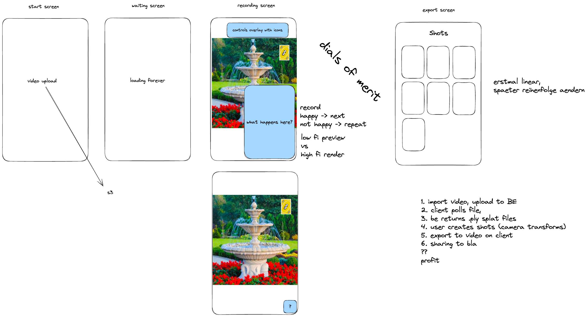

# Splat Belt

Toolbelt for Gaussian Splatting Experiments.

# Idea

[]

## GPU instances with Brev

[Brev](https://brev.dev/) is used for GPU instance provisioning.

If a [brev token](https://console.brev.dev/profile) is stored in `brev-token.txt`,
the `brev` command is set up in the devcontainer.

## FAQ

Q: Issue with upload, minio name not resolved

A: `sudo sh -c 'echo "127.0.0.1 minio" >> /etc/hosts'`
